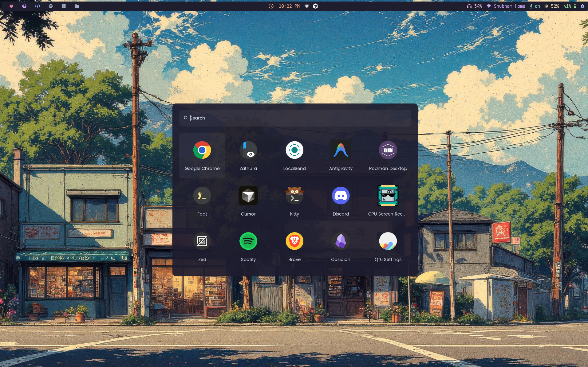
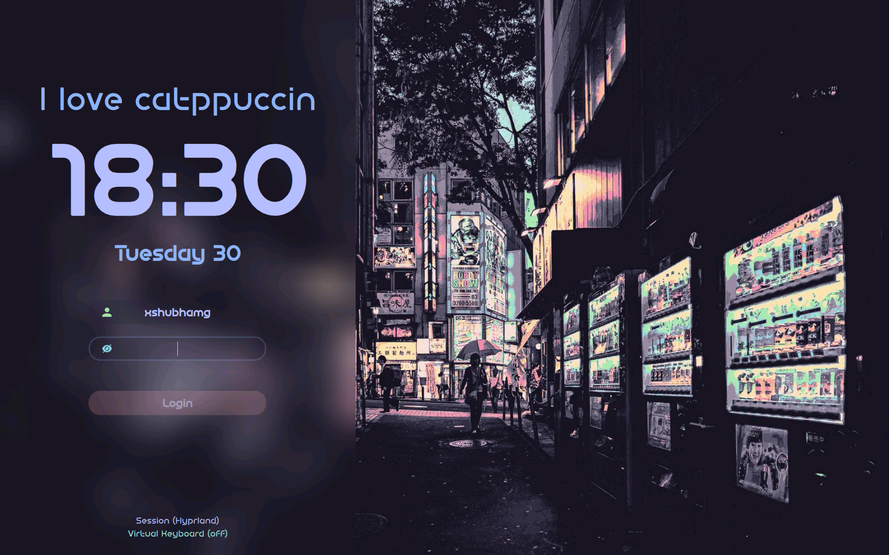
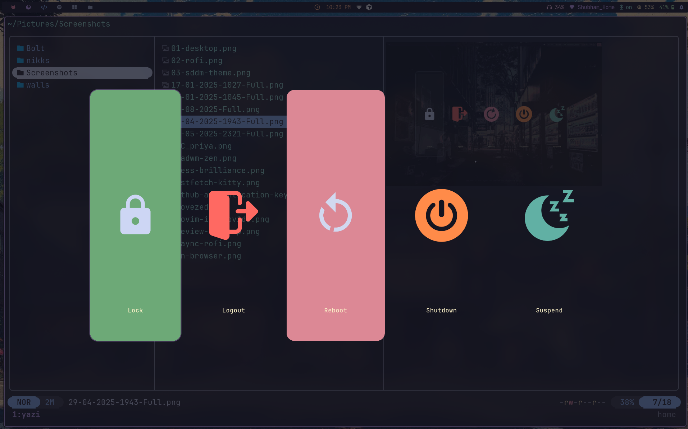
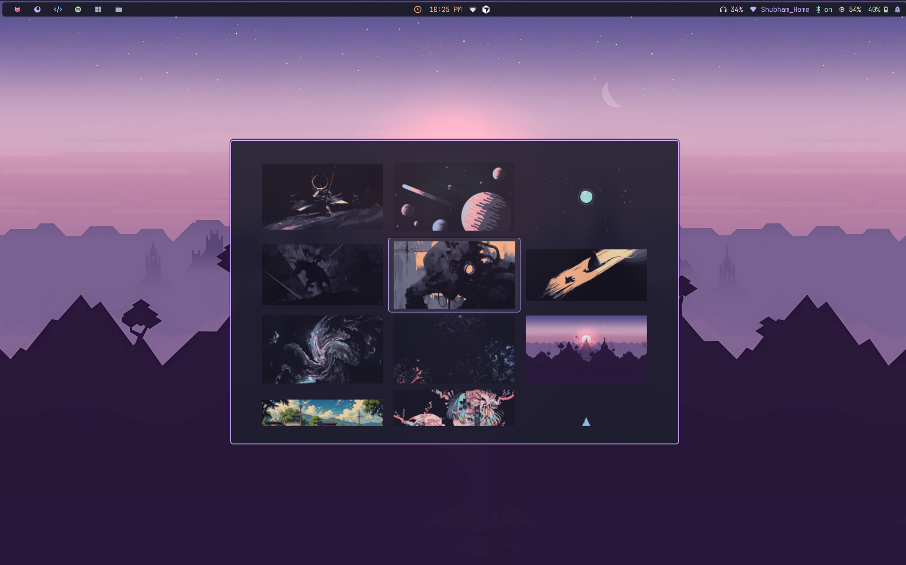
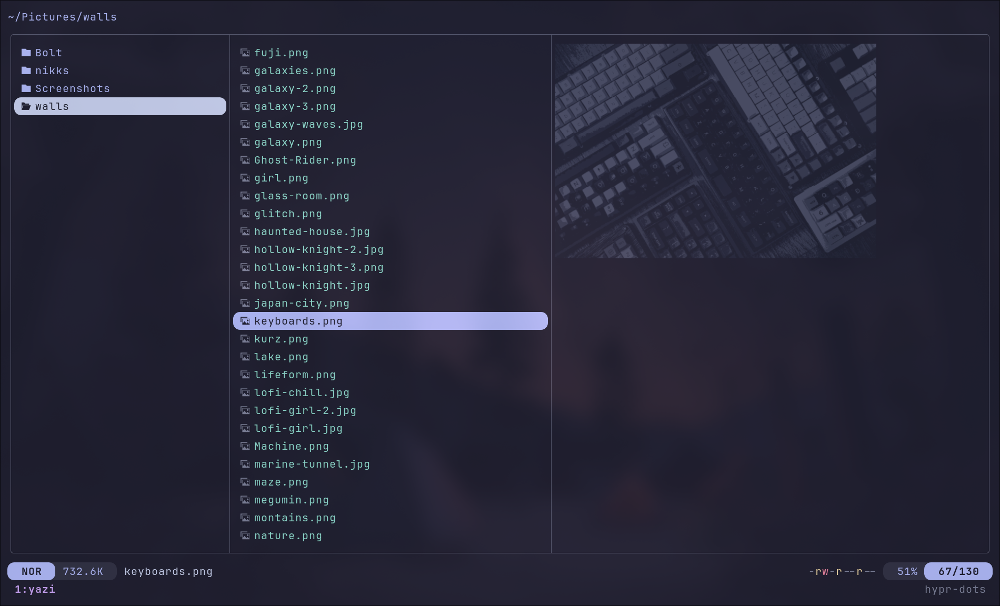
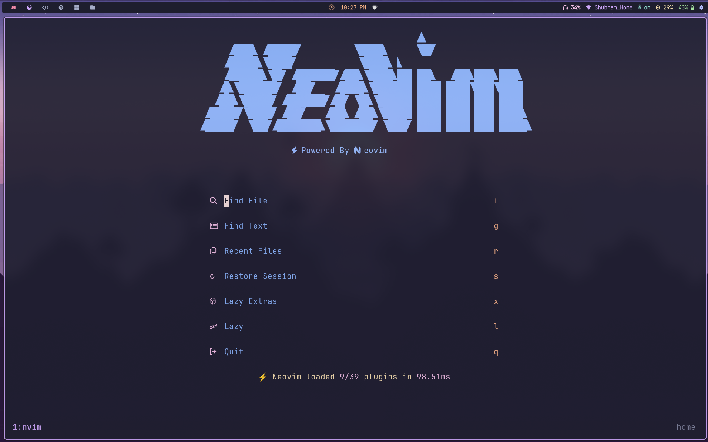
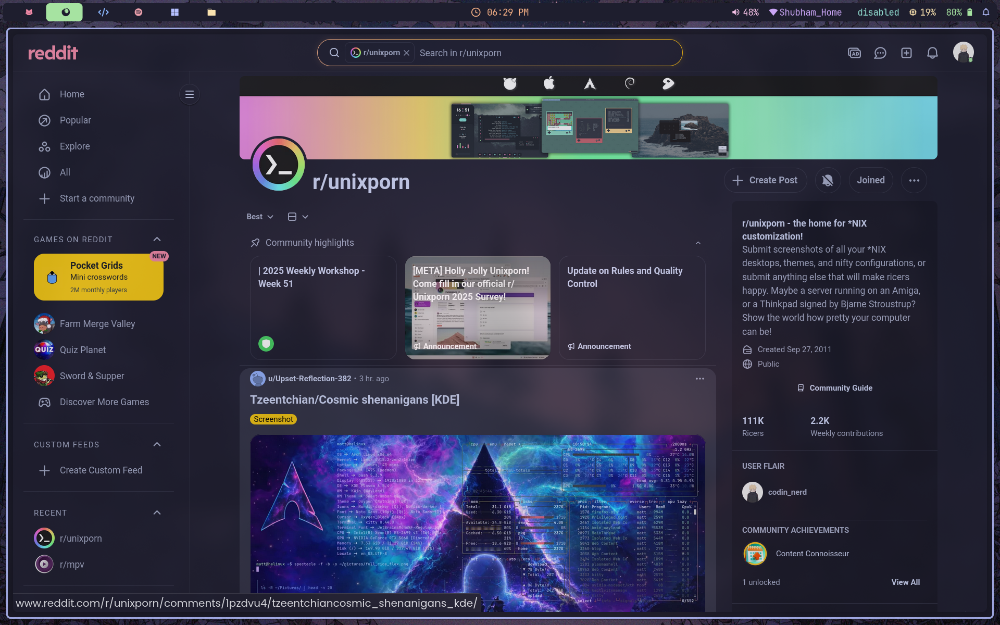

<div align="center">

# Arch + Hyprland Dotfiles

**A Catppuccin Mocha themed Arch Linux desktop built around Hyprland, Waybar, Rofi, and a curated set of daily-driver tools.**

[](https://archlinux.org/)
[](https://hyprland.org/)
[](https://catppuccin.com/)
[](LICENSE)

<br>

<p align="center">
  <video src="https://github.com/XshubhamG/hypr-dots/raw/main/assets/tour.mp4"
         controls
         width="100%">
  </video>
</p>

</div>

---

## Screenshots

<div align="center">

| | |
|:---:|:---:|
|  |  |
| **Rofi Launcher** — `Super + R` | **SDDM Login Theme** — Catppuccin styled greeter |
|  |  |
| **wlogout** — `Super + Shift + M` | **Waypaper** — `Super + W` |
|  |  |
| **Yazi File Manager** — with image previews | **Neovim** — LazyVim dashboard |
|  | |
| **Zen Browser** — Catppuccin themed | |

</div>

---

## Overview

This repo tracks the desktop environment I daily-drive on Arch Linux. The Hyprland config is split into small, focused modules for monitors, colors, autostart, rules, plugins, and keybinds. The same Catppuccin Mocha palette carries through Waybar, Rofi, Kitty, Zed, Neovim, and fastfetch.

The workflow revolves around `foot`, `kitty`, `rofi`, `waypaper`, `wlogout`, `swaync`, `yazi`, `btop`, `hyprshot`, and `satty`, with app bindings for Brave, Zen Browser, Obsidian, and Spotify.

---

## Stack

| Area | Tools |
| :--- | :--- |
| Window manager | Hyprland, hypridle, hyprlock, hyprsunset |
| Status and launchers | Waybar, Rofi, swaync, wlogout |
| Wallpaper and visuals | Waypaper, awww, Bibata cursor, Catppuccin Mocha |
| Terminals and CLI | foot, kitty, Zsh, fastfetch, btop, yazi |
| Editing | Neovim, Zed, Cursor |
| Screenshots and color tools | hyprshot, satty, hyprpicker |
| Login manager | SDDM with a custom Catppuccin theme |

---

## Hyprland Layout

The main config stays small and pulls the desktop together from focused modules:

```text
.config/hypr/
├── hyprland.conf
├── hyprlock.conf
├── hyprsunset.conf
├── scripts/
└── modules/
    ├── animation.conf
    ├── autostart.conf
    ├── colorscheme.conf
    ├── customization.conf
    ├── env.conf
    ├── inputs.conf
    ├── keybinds.conf
    ├── monitors.conf
    ├── plugins.conf
    ├── windowrules.conf
    └── workspacerules.conf
```

This split makes it easy to swap monitor settings, change startup apps, or tweak visuals without digging through one giant config file.

---

## Keybinds

| Keybind | Action |
| :--- | :--- |
| `Super + Return` | Open `foot` |
| `Super + R` | Open the Rofi launcher |
| `Super + W` | Open Waypaper |
| `Super + Shift + W` | Set a random wallpaper |
| `Super + P` | Launch `btop` in `foot` |
| `Super + Y` | Launch `yazi` in `foot` |
| `Super + Shift + L` | Lock with `hyprlock` |
| `Super + Shift + M` | Open `wlogout` |
| `Print` | Screenshot the output |
| `Super + Print` | Region screenshot piped into `satty` |

For the full set, see [`.config/hypr/modules/keybinds.conf`](.config/hypr/modules/keybinds.conf).

---

## Install

There is no installer script. Clone, back up existing configs, then symlink the parts you want.

```bash
git clone https://github.com/xshubhamg/hypr-dots.git "$HOME/hypr-dots"

mkdir -p "$HOME/.config"

for dir in hypr waybar rofi wlogout kitty fastfetch btop zsh; do
  mv "$HOME/.config/$dir" "$HOME/.config/$dir.bak" 2>/dev/null || true
  ln -snf "$HOME/hypr-dots/.config/$dir" "$HOME/.config/$dir"
done
```

Adjust the list to match what you actually want to use.

---

## Machine-Specific Notes

Before using these configs as-is, update the parts that depend on your hardware or home directory:

- **`monitors.conf`** — set your monitor layout and scale in `.config/hypr/modules/monitors.conf`.
- **`hyprlock.conf`** — references `/home/xshubhamg/...` paths for the wallpaper and profile image.
- **`waypaper/config.ini`** — points to `~/Pictures/walls` and a local stylesheet path.
- **`fastfetch/config.jsonc`** — references a local logo image at `~/.config/fastfetch/archlinux.png`.
- **`keybinds.conf`** — assumes tools like `brave`, `zen-browser`, `obsidian`, `spotify`, `foot`, `kitty`, and `yazi` are installed.

---

## Fonts and Theming

| Purpose | Font |
| :--- | :--- |
| Terminal | JetBrainsMono Nerd Font Mono |
| Icons | Symbols Nerd Font Mono |
| UI elements | Poppins |

The color system is **Catppuccin Mocha** across Hyprland, Waybar, Kitty, Neovim, and editor theming.

---

## Credits

- [Catppuccin](https://catppuccin.com/) — color palette and visual inspiration.
- [Nerd Fonts](https://www.nerdfonts.com/cheat-sheet) — glyphs used across the setup.
- [Catppuccin Mocha wallpapers](https://github.com/orangci/walls-catppuccin-mocha) — matching wallpaper pack.
- [Skill Icons](https://skillicons.dev/) and [svgl](https://svgl.app/) — README icon resources.
